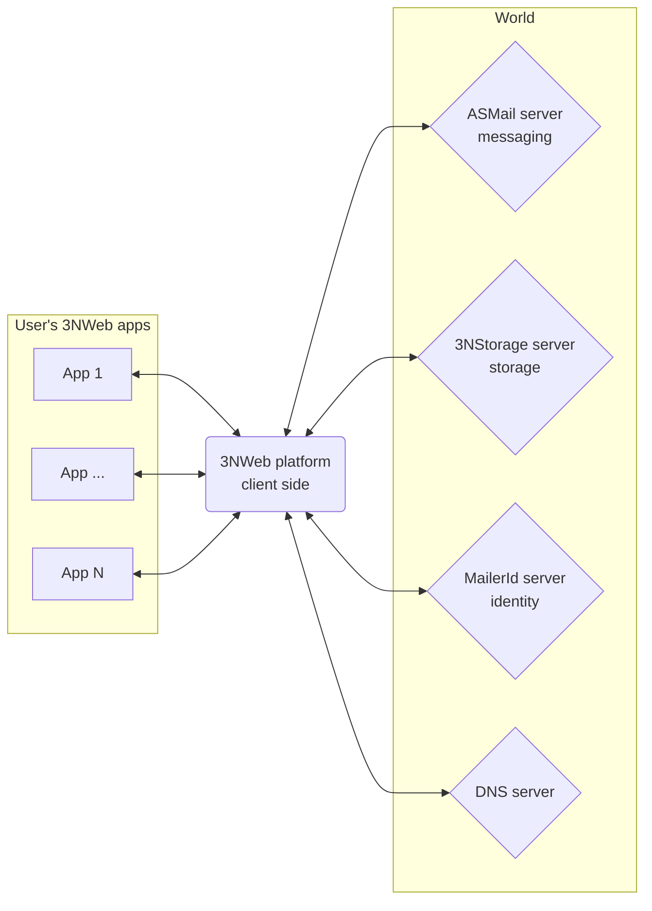
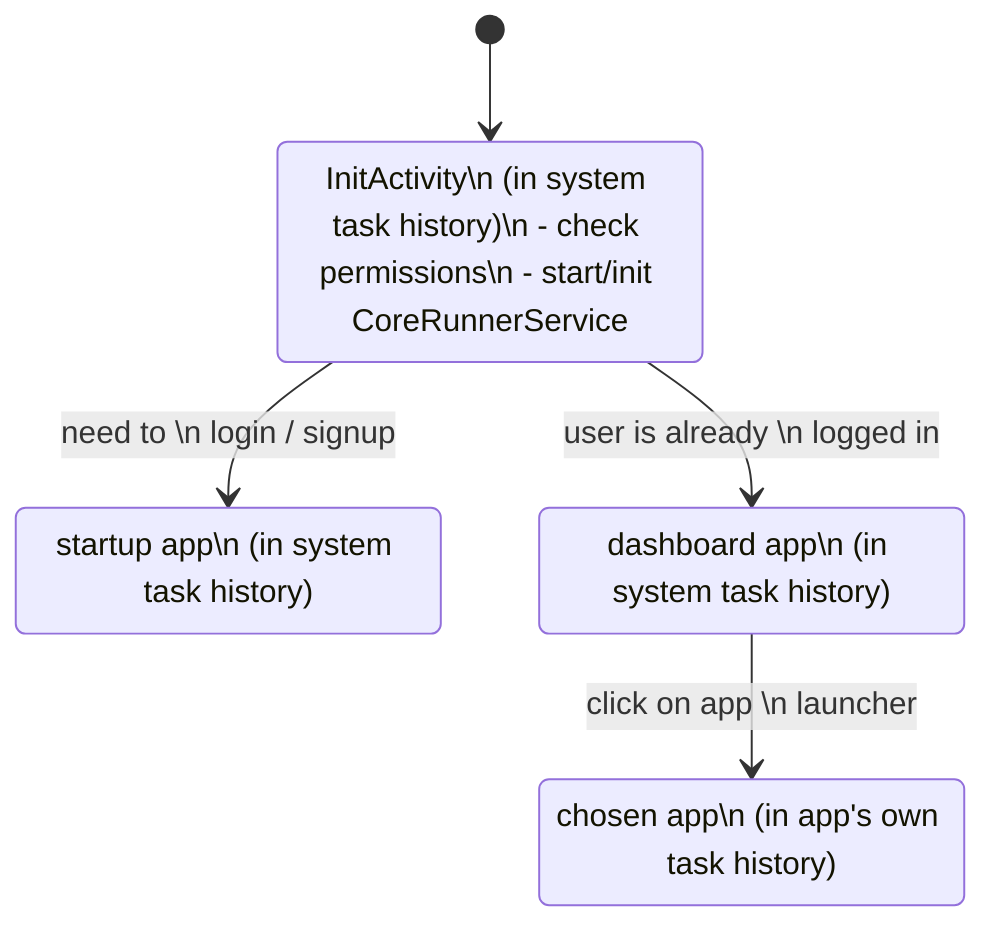

# PrivacySafe platform on Android

This repository contains client-side 3NWeb platform.
Platform's core talks 3NWeb protocols with servers, does all of crypto, keeps all user's keys, and provides an easy-to-use API for apps that run in 3NWeb platform.

This is an Android implementation of 3NWeb platform.

## Main parts

Platform's main process instantiates 3NWeb app components in respective isolated runtime environments.
This uses `WebView` and `JSEngine` for JS runtimes to run 3NWeb apps' components.

Core at this moment comes in JS, and it is also run in `JSEngine`'s isolate, like headless components, but with 
different injected things into it.
TypeScript builds in `platform-ts` (see [README.md](./platform-ts/README.md)) are triggered by gradle build tasks.

Bundled apps are placed into `assets` folder, but they are copied from `platform-ts` that has script to 
download them. Download process takes longer time, therefore, it isn't wired into build tasks, requiring to do 
it at least once.

`WebView` injects into JS some methods from Android side, while bulk of ipc, ipc between app component and the 
core, is passed via `MessagePort`.

`JSEngine` doesn't have clean/simple methods injection into JS from Android side, forcing us into using 
`MessagePort`'s for invoking methods from Android in JS, and from in JS in Android.
Passing ipc messages from app components to core is done via `MessagePort`'s and `Channel` piping from one 
runtime to another.

## Flow in Android code

[This readme](./platform-ts/README.md) in platform's folder keeps more details about gluing Android and JS parts: what and when to pass which signal to keep state of subsystems in sync.
