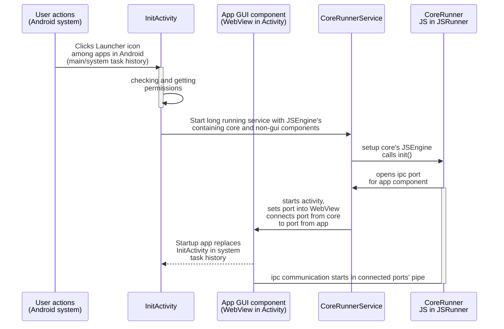
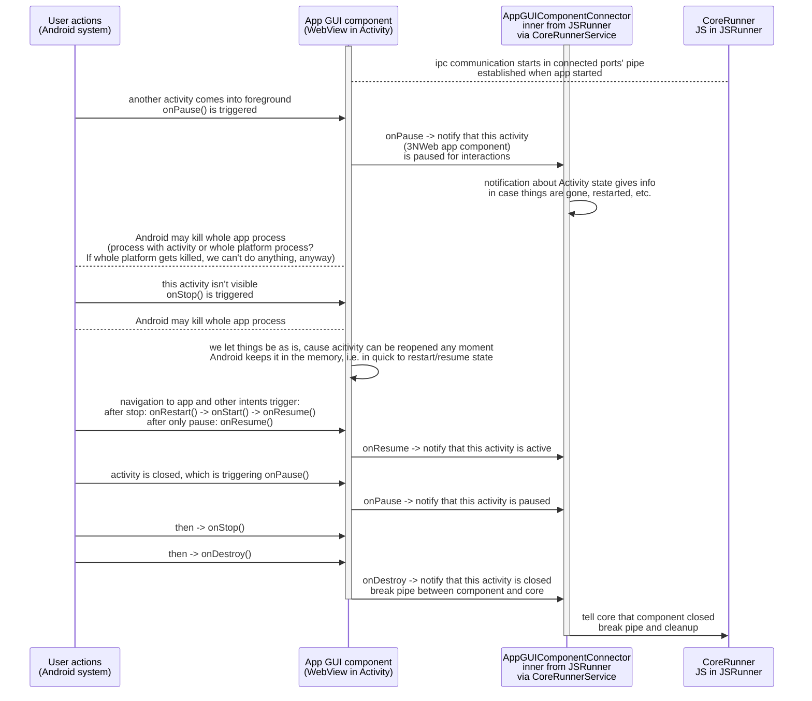

# PrivacySafe platform for Android

### Starting platform

### Activity lifecycle and app component

Android activities have a lifecycle, [described here](https://developer.android.com/guide/components/activities/activity-lifecycle#activity-lifecycle-concepts). The following diagram suggest what we should do between subsystems -- what info passed, and when -- to run platform in Android way on Android.

Note from reading [Android docs](https://developer.android.com/guide/components/processes-and-threads) we may play with separating different processes, besides multiple threads. This may or may not be useful in contexts of performance, and cleaing/killing things for memory by us and system.

